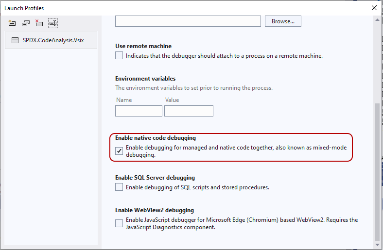
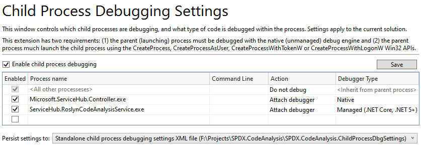

# Visual Studio Debugging

Debugging the project in Visual Studio 2022 requires the [Microsoft Child Process Debugger Power Tool 2022](https://marketplace.visualstudio.com/items?itemName=vsdbgplat.MicrosoftChildProcessDebuggingPowerTool2022). This is a requirement because starting the debugger session creates multiple processes and we need to inform the debugger which one we want to attach to. The extension makes this automatic, since the settings will load from the `Lucene.Net.CodeAnalysis.Dev.ChildProcessDbgSettings` file in the solution directory.

### Setting up Debugging Manually

This is how the settings should be configured to debug a Roslyn analyzer when using Visual Studio 2022.

1. Install the [Microsoft Child Process Debugger Power Tool 2022](https://marketplace.visualstudio.com/items?itemName=vsdbgplat.MicrosoftChildProcessDebuggingPowerTool2022) extension.
2. In the VSIX project, choose Properties and then select the Debug tab, ensure that native debugging is enabled.

   

3. In the VS extension configuration available via Debug > Other Debug Targets > Child Process Debugging Settings..., set up the settings like the following.

   

> **NOTE:** Since these settings are already configured in the repository, there should be no need to change them.

### Starting Debugging

Since the `Lucene.Net.CodeAnalysis.Dev.Vsix` project appears first in the solution file, it should be highlighted as the default project. If not, select it, right-click, and choose Select as Startup Project.

Click on the play button or F5 to begin the debugging session. This will take a while for the first start, as it needs to download all native symbols first. However, this is a one-time startup cost.

This launches a test instance of Visual Studio 2022. From there, you can create a new solution and use it to trigger various analyzer violations and walk through how the UX works for the user. You can also step into code, set and hit breakpoints.
